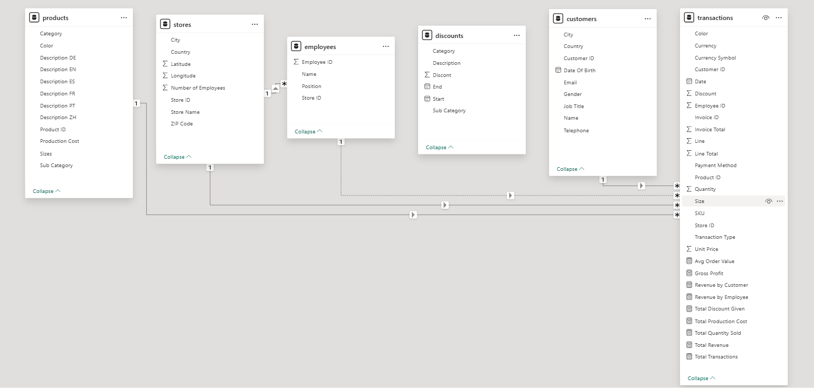
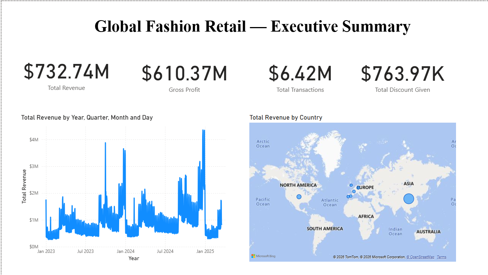
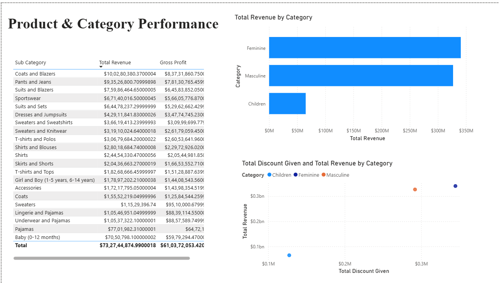
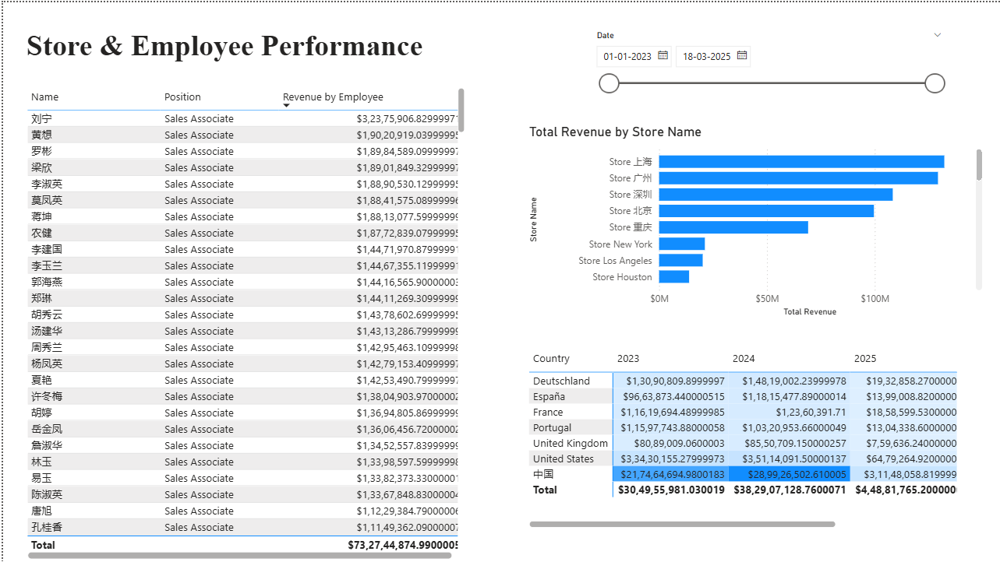
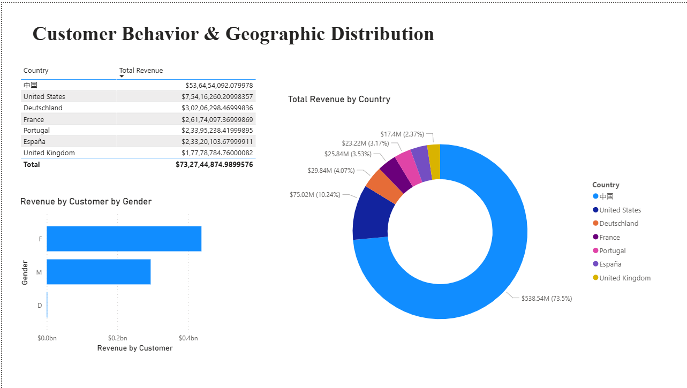

# Global Fashion Retail Sales Analysis

## Overview
End-to-end business intelligence analysis of a multinational fashion retailer's sales data, covering transactions, products, stores, employees, and customers across multiple countries. Built using SQL for data querying and Power BI for interactive dashboarding and data modeling.

## Dataset Overview
This project uses a synthetic dataset simulating two years of transactional data for a multinational fashion retailer, featuring:
- 4+ million sales records
- 35 stores across 7 countries: United States, China, Germany, United Kingdom, France, Spain, Portugal
- Linked tables for transactions, products, stores, employees, and customers

Source: [Global Fashion Retail Sales Dataset — Kaggle](https://www.kaggle.com/datasets/ricgomes/global-fashion-retail-stores-dataset)

## Business Questions Answered

**Which stores and regions generate the most/least revenue?**
Shanghai is the top-performing store by a wide margin, followed by other Chinese stores, then US and European locations. China as a country contributes ~73-74% of total revenue.

**Which product categories drive the most revenue and profit?**
Feminine and Masculine clothing categories dominate revenue and profit; the Children's category is comparatively small, suggesting either an intentional focus or an area for potential growth.

**Who are the top-performing employees and highest-value customers?**
A small group of sales associates consistently outperform their peers (see employee ranking in dashboard/SQL). Top 10 customers were identified by total spend, led primarily by US-based customers.

**How concentrated is revenue across countries, and what risk does that pose?**
Revenue is heavily concentrated in China (~73-74% of total), with the remaining ~26% spread across the US, Germany, France, Spain, Portugal, and the UK — indicating meaningful geographic dependency risk.

**Are there seasonal or monthly revenue trends?**
Yes — the monthly revenue trend (Executive Summary page) shows recurring peaks, useful for planning inventory and staffing around high-demand periods.

## Data Model
Five linked tables (Transactions, Products, Stores, Employees, Customers) connected through a star-schema relationship model in Power BI. Role-playing relationships (e.g., Customer ID and Employee ID both relating to Transactions) were resolved using DAX's `USERELATIONSHIP` function.

## Dashboard
Built as a 4-page interactive Power BI report:
1. **Executive Summary** — KPIs, revenue trend, revenue by country map
2. **Product Performance** — category revenue, sub-category profitability, discount impact
3. **Store & Employee Performance** — store rankings, employee rankings, country-by-month heatmap
4. **Customer Behavior** — revenue by country, gender-based spending, customer geographic distribution

📊 Download the full Power BI dashboard (https://drive.google.com/file/d/10mc2reMcRLxqbhAPBtKNDtIb3qJHaZu3/view?usp=sharing)

## Key Insights
- China contributes ~73-74% of total revenue — a significant geographic concentration risk worth addressing through market diversification.
- Shanghai is the top-performing store by a wide margin, ahead of both other Chinese and Western stores.
- Feminine and Masculine categories dominate revenue; Children's category is comparatively underdeveloped.
- A small group of employees consistently outperform peers, useful for training/onboarding best practices.
- Key metrics were cross-validated in both Power BI and SQL, with matching results confirming analysis accuracy.

See [insights.md](insights.md) for the full write-up.

## Tools Used
- **SQL** (SQLite via DB Browser) — joins across 5 tables, aggregations, revenue concentration analysis
- **Power BI** — data modeling, DAX measures, multi-page interactive dashboard
- **DAX** — including `USERELATIONSHIP` for resolving ambiguous relationships

## Files in this Repo
- `data/` — raw dataset (Kaggle: Global Fashion Retail Sales)
- `sql/queries.sql` — all SQL queries used in the analysis
- `dashboard/global_fashion_dashboard.pbix` — full Power BI report file
- `insights.md` — detailed findings and recommendations

